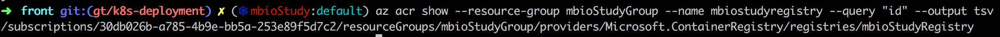
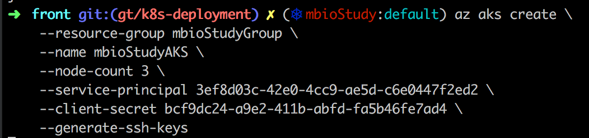

# ACR 연동해서 AKS 설치

1. azure container registry(ACR) 생성 (mbioStudyGroup내에)

2. ACR에 로그인

3. Login 되어있는 ACR 확인

4. ACR 서버명으로 도커 이미지 만들고 push 테스트 (mbiostudyregistry.azurecr.io)

5. AKS와 ACR의 연동을 위한 service principal 생성

6. 만들어 놓은 ACR (도커 레지스트리) id 추출 -> AKS랑 연동하기 위해 필요

7. 생성할 AKS에서 만들어 놓은 ACR에서 도커 이미지 땡길수 있게 role 생성

8. service-principal 정보를 추가해 AKS 클러스터 생성

9. kubectl 설치

10. 클러스터 정보 로컬에 설치

참고 : https://docs.microsoft.com/ko-kr/azure/aks/tutorial-kubernetes-prepare-app