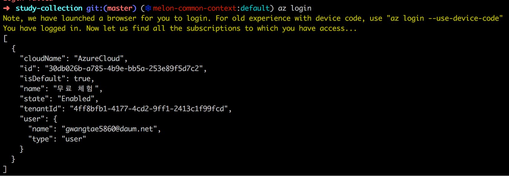
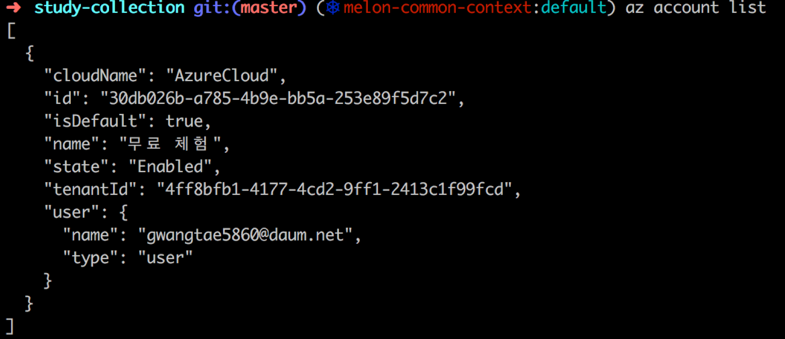
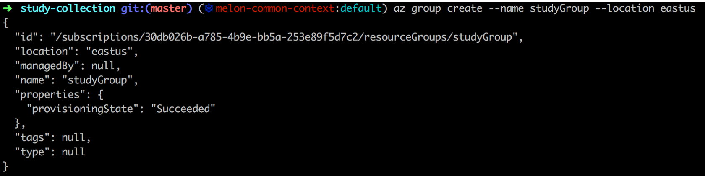
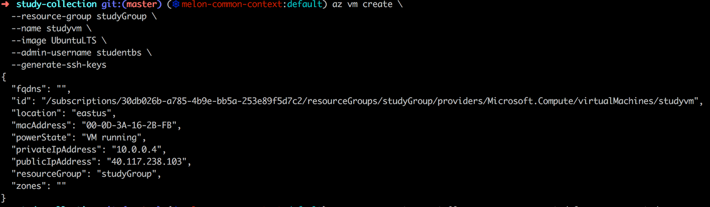
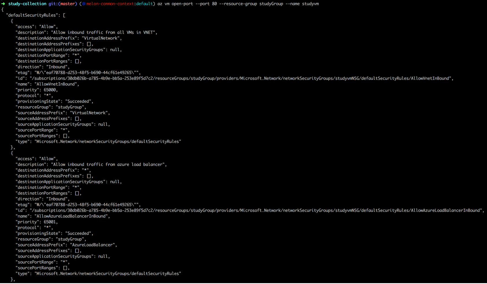
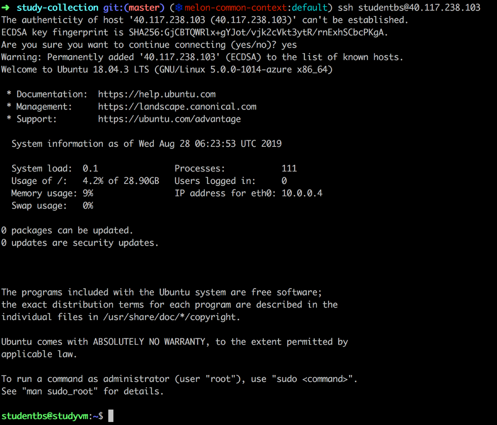
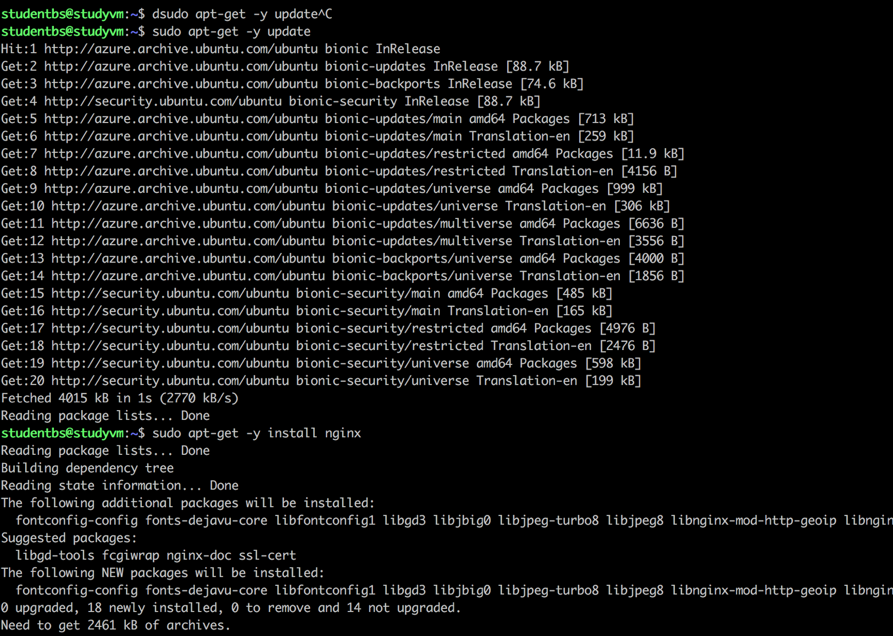
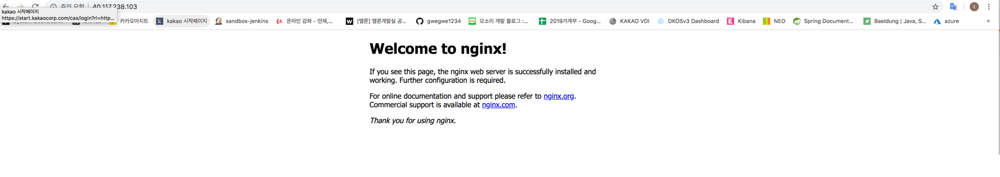

# Azure
### Azure VM 생성 및 계정 / ip 정보

1. Azure login

2. Azure account list

3. Group 생성 (studyGroup) 

4. VM 생성 
- name : studyvm
- username: studentbs
- public Ip: 40.117.238.103

5. 80 port open

6. 생성한 vm 접속 (studentbs@40.117.238.103)

### Azure nginx 테스트

1. nginx 설치

2. 접속 확인 (http://40.117.238.103)

