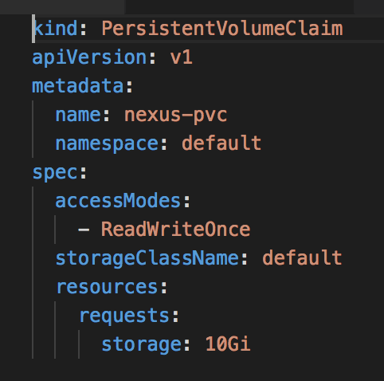
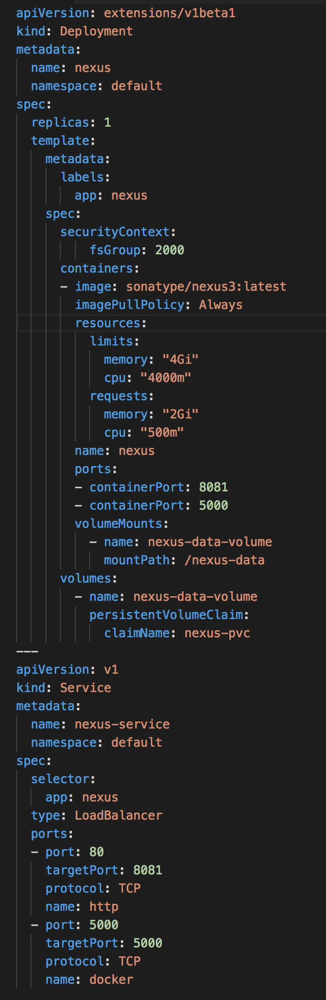
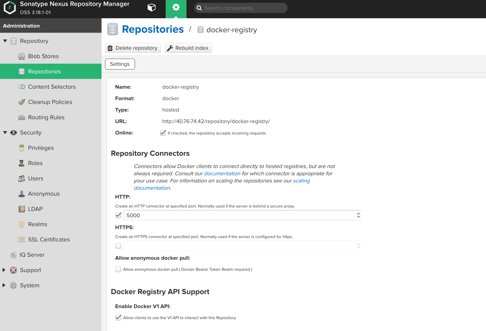
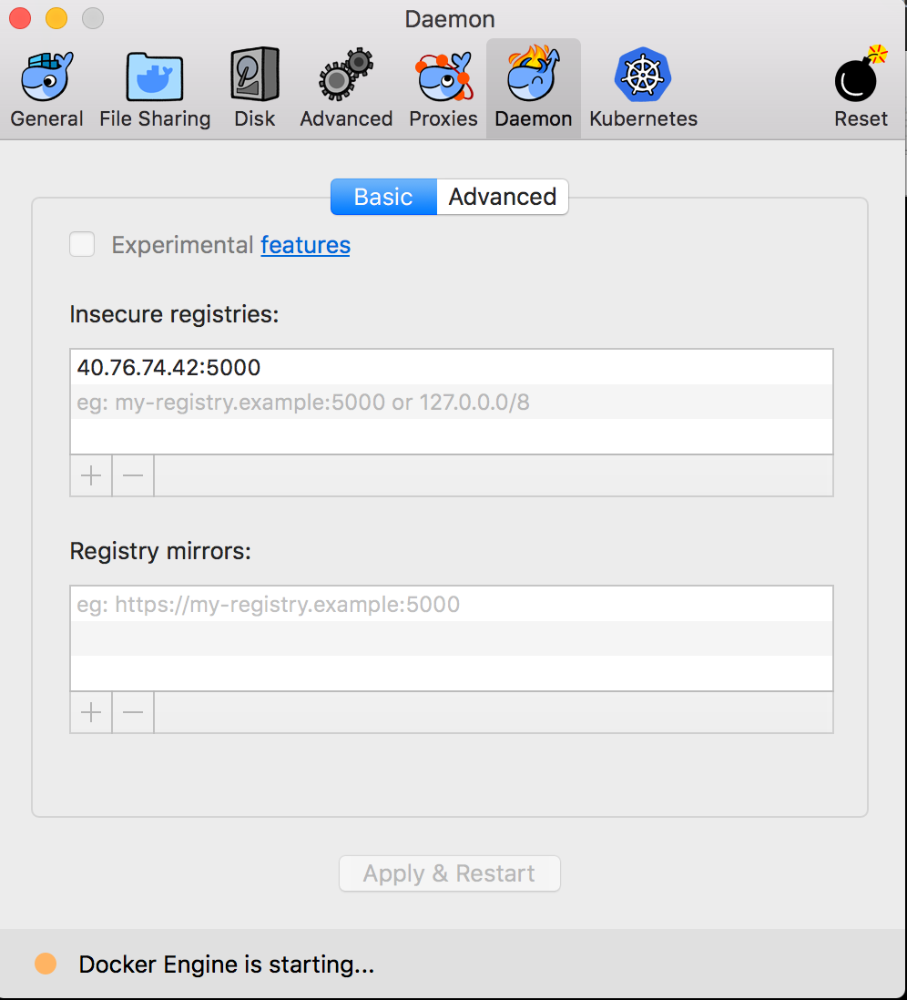
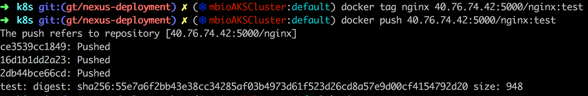

# Nexus3 k8s 구성

1. nexus k8s yaml 구성




```
특이설정 

port 2개 설정
-> nexus 접근 port와 docker private registry 접근용 포트 설정 필요

securityContext 설정 추가 
```

2. nexus 접근
```
http://40.76.74.42
admin / admin123
```

3. docker private registry 생성



4. 도커 insecure 설정 추가

```
docker private registry를 v1 (http) 설정을 해줘서 도커에 http 접근 가능하도록 설정 필요
```



5. docker 이미지 업로드 테스트

